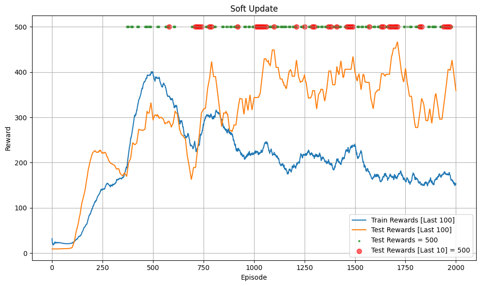
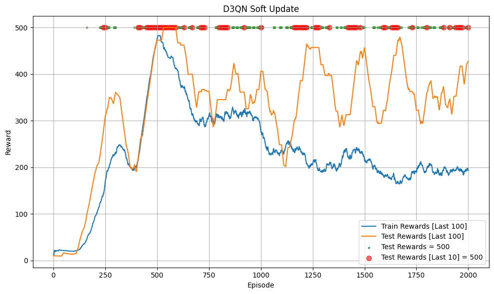
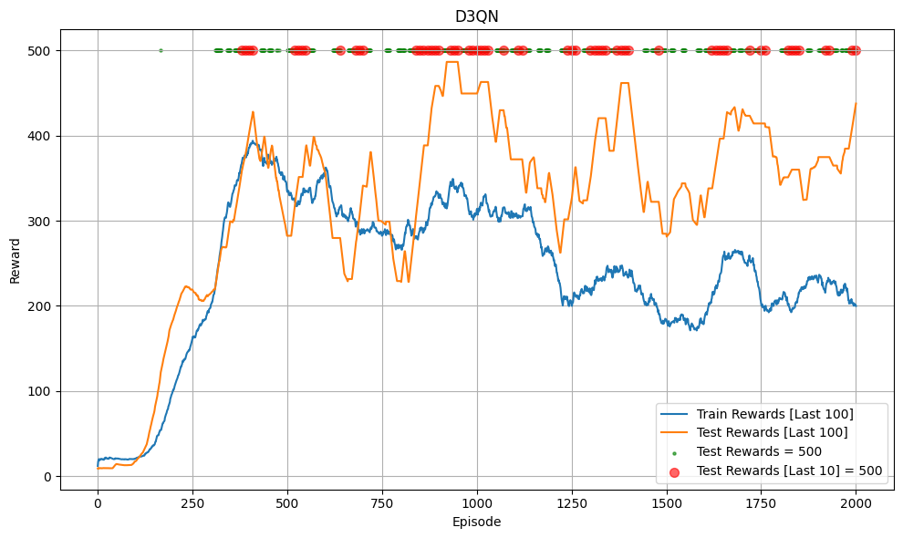
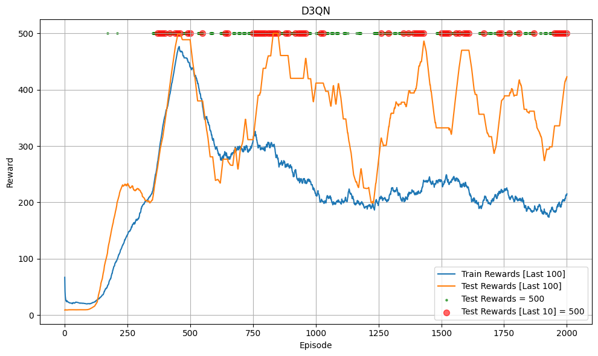

# Dueling Double Deep Q-Network (D3QN)

## Introduction

This project is a Pytorch minimal implementation of `Dueling Double Deep Q-Network (D3QN)`. D3QN is a combination of the `Double DQN` algorithm and the `Dueling Network` architecture from `Dueling DQN`.

## Algorithm

It is recommended to first understand `Deep Q-Learning (DQN)`, `Double DQN`, and `Dueling DQN`. This algorithm uses a model like Dueling DQN: splitting Q into V and A, and a Target Network calculation method like Double DQN: using the Online Model to select the next action $a'$ and using the Target Model to calculate $Q(s', a')$.

## Code Structure

The code to test D3QN with `**CartPole-v1**` is in [this notebook](D3QN.ipynb). Note: the code may contain some bugs or is not optimized!!!

## Trained Model

You can load the [trained model](trained_model)

## Hyperparameter
Hyperparameters are similar to DQN, you should be careful when tunning as the algorithm is sensitive to hyperparameters:
- `gamma`: 0.99
- `batch_size`: 64
- `buffer_size`: 100000
- `total_episodes`: 2000 (number of episodes training)
- `start_training_step`: 1000 (environment step to start training from)
- `learning_rate`: 2.3e-3
- `train_frequency`: 4 (train the model every `train_frequency` environment steps)
- `epochs`: 1 (train for 128 epochs each training time)
- `update_frequency`: 100 (update target model every `update_frequency` environment steps) or `tau` = 0.005 (for soft updates every environment step)
- `epsilon` (ε):
    - `init`: 1.0
    - `end`: 0.04
    - Linear decay over `exploration_fraction` = 0.16 (the first 16% of `total_steps`)

## Result

Below are the results from training with soft updates (run 2 times):

  
  

Below are the results from training with out soft updates (run 2 times):

  
  

The resulting model reached the maximum total reward:
- With both soft update and no soft update, the model quickly reached the maximum total reward (500) during testing and maintained the 500 level afterwards.
- This environment is very simple, used only to check if the code works, so it's not possible to compare the two update methods or compare it with DQN, Double DQN, and Dueling DQN.

**Note**:
- The code may contain some bugs
- A Chatbot was used in this project to fix typos or format the code!

## Reference
- [DQN paper](https://arxiv.org/pdf/1312.5602)
- [Double DQN paper](https://arxiv.org/pdf/1509.06461)
- [Dueling DQN paper](https://arxiv.org/pdf/1511.06581)