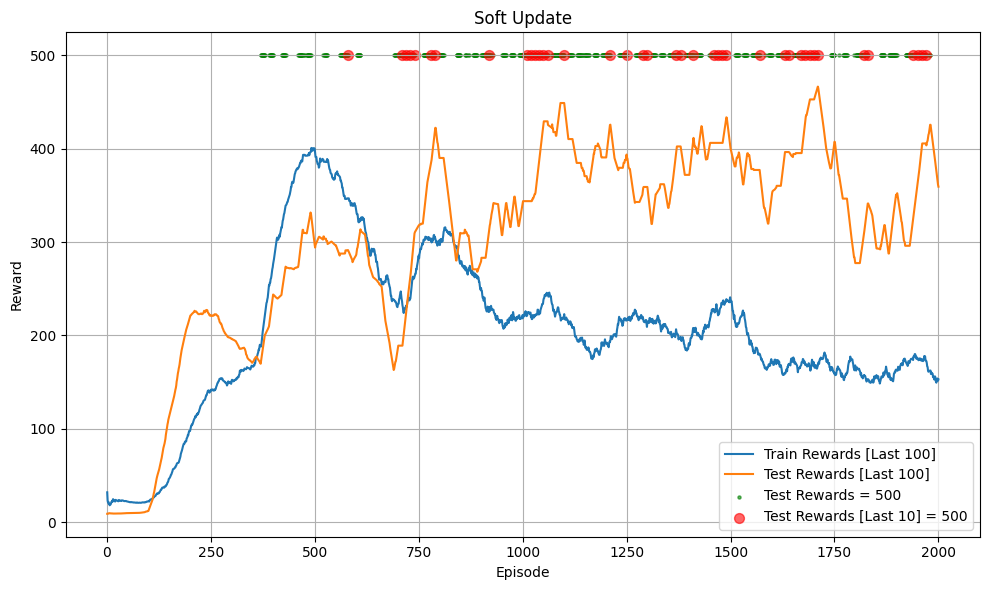
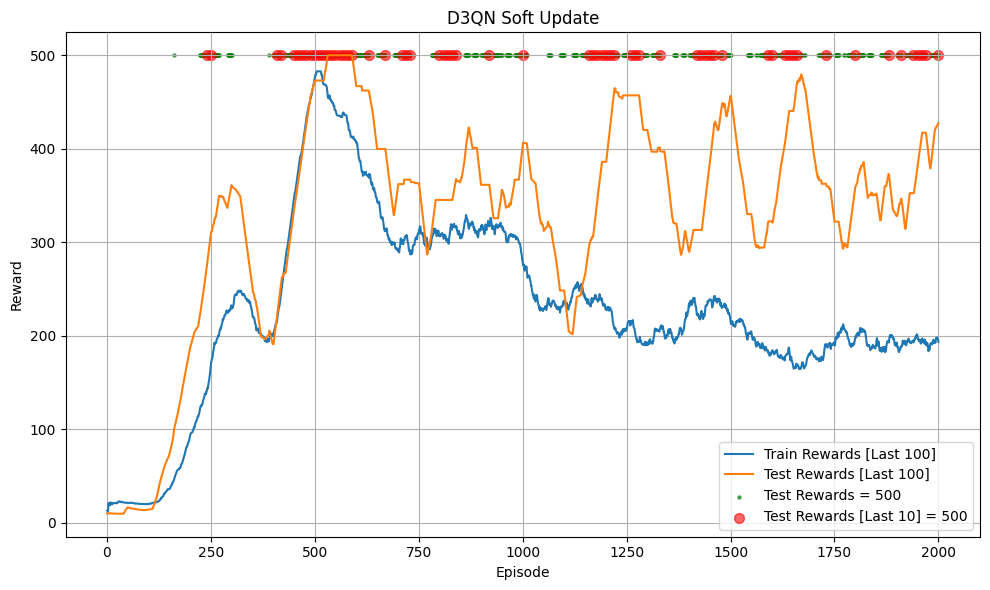
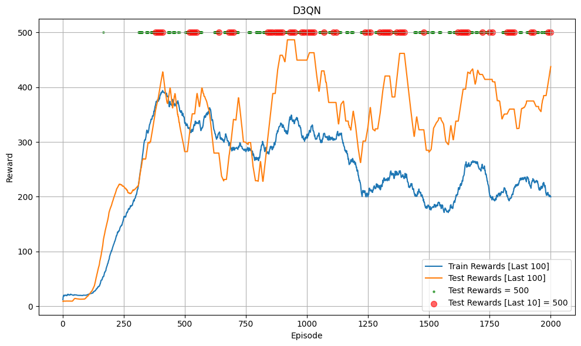
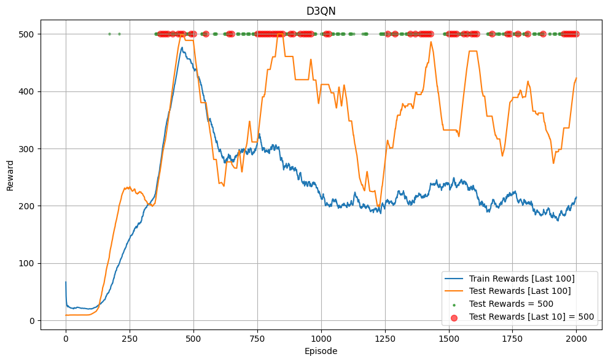

# Dueling Double Deep Q-Network (D3QN)

## Introduction

Project này là Pytorch minimal implementation `Dueling Double Deep Q-Network (D3QN)`. D3QN là sự kết hợp giữa thuật toán `Double DQN` và kiến trúc `Dueling Network` trong `Dueling DQN`.

## Algorithm

Cần tìm hiểu `Deep Q-Learning (DQN)`, `Double DQN` và `Dueling DQN` trước. Thuật toán này sử dụng Model như Dueling DQN: tách Q thành V và A và cách tính Target Network như Double DQN: dùng Online Model để chọn next action $a'$ và dùng Target Model để tính $Q(s', a')$.

## Code Structure

Code chạy thử nghiệm D3QN với `**CartPole-v1**` trong [nodebook này](D3QN.ipynb). Lưu ý: code có thể tồn tại một số bug hoặc không tối ưu!!!

## Trained Model

Bạn có thể load [trained model](trained_model)

## Hyperparameter
Siêu tham số tương tự DQN, bạn cần lưu ý khi tunning vì thuật toán nhạy cảm với siêu tham số:
- `gamma`: 0.99
- `batch_size`: = 64
- `buffer_size` = 100000
- `total_episodes` = 2000 (số episode training)
- `start_training_step` = 1000 (train từ environment step nào)
- `learning_rate` = 2.3e-3
- `train_frequency`= 4 (train model sau mỗi `train_frequency` environment step)
- `epochs` = 1 (mỗi lần train model sẽ train 128 epoch)
- `update_frequency` = 100 (cập nhật target model sau `update_frequency` environment step) hoặc `tau` = 0.005 (soft update mỗi environment step)
- `epsilon` (ε):
    - `init`: 1
    - `end`: 0.04
    - Linear decay với `exploration_fraction` = 0.16 (16% `total_steps` đầu)

## Result

Dưới đây là kết quả khi train dùng soft update (chạy thử 2 lần):

  
  

Dưới đây là kết quả khi train không dùng soft update (chạy thử 2 lần):

  
  

Kết quả model đã đạt tổng phần thưởng tối đa:
- Với cả soft update và không dùng soft update, model nhanh chống đạt tổng phần thưởng tối đa (500) khi test và duy trì mức 500 sau đó.
- Environment này rất đơn giản, chỉ để kiểm tra code có hoạt động không nên không thể so sánh 2 cách update hoặc so sánh với DQN, Double DQN, Dueling DQN.

**Lưu ý**:
- Code có thể tồn tại 1 số bug
- Project có dùng Chatbot để chỉnh lỗi chính tả hoặc format code!

## Reference
- [DQN paper](https://arxiv.org/pdf/1312.5602)
- [Double DQN paper](https://arxiv.org/pdf/1509.06461)
- [Dueling DQN paper](https://arxiv.org/pdf/1511.06581)