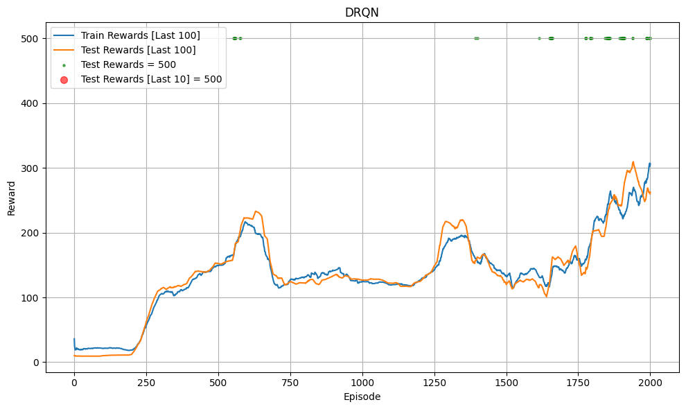
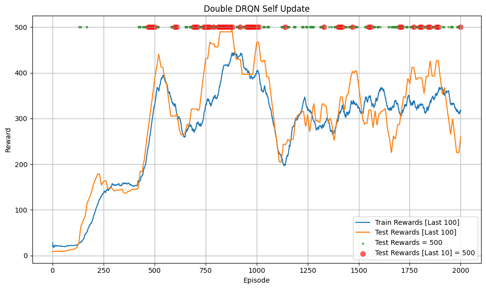
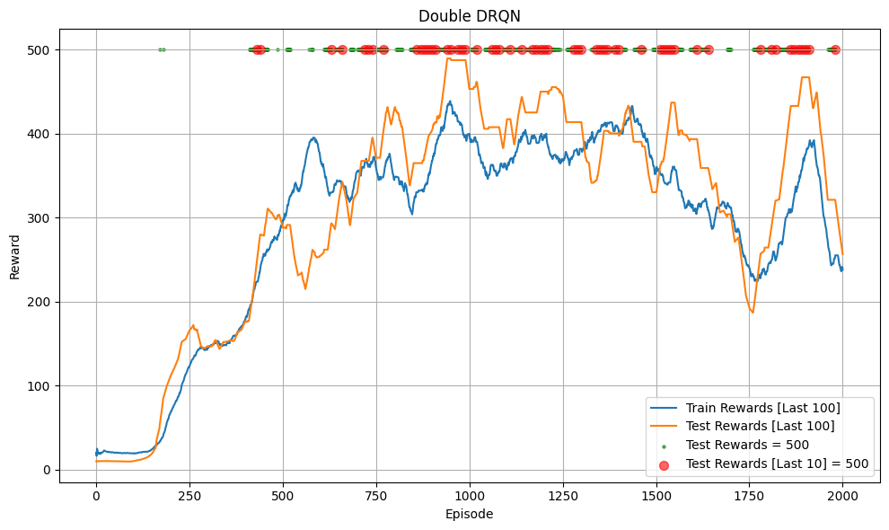
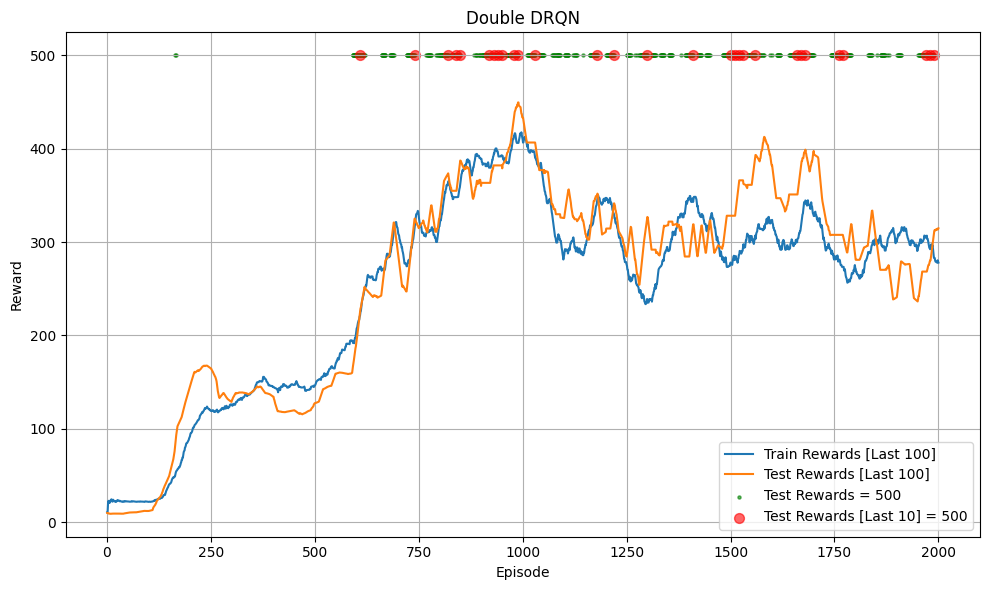

# Deep Recurrent Q-Learning (DRQN)

## Introduction

This project is a Pytorch minimal implementation of [Deep Recurrent Q-Learning (DRQN)](https://arxiv.org/pdf/1507.06527). based on my knowledge, DRQN was first introduced in the paper [Deep Recurrent Q-Learning for Partially Observable MDPs](https://arxiv.org/pdf/1507.06527) as a combination of RNN architecture and DQN, leveraging the advantages of RNNs to solve Partially Observable MDPs (POMDPs) (where the Agent can only observe a portion of information at each step, leading to incomplete information, for example: only seeing a part of the screen like a player, not the entire map in the environment). with traditional DQN approaches (implemented in DQN, Double_DQN, Dueling DQN, ...), the solution is `frame stack` (stacking 4 most recent observations into a state input) to help the Agent understand information from previous steps. DRQN introduces a more effective way to use RNNs (in many cases) instead of frame stacking.

The paper [ViZDoom: DRQN with Prioritized Experience Replay, Double-Q Learning, & Snapshot Ensembling*](https://arxiv.org/pdf/1801.01000) improves DRQN by combining DRQN with Double Q learning, Prioritized Experience Replay, and Snapshot Ensembling for good results in the game Doom. the paper also mentions a trick for updating: for each sequence sampled, only the last samples in the sequence are used for updating; the initial samples will not have gradients computed (detached), and there is no report on the impact of this trick!.

To simplify implementation, I have only coded the original DRQN and Double-DRQN (Double-DRQN will use the detach trick mentioned above).

## Algorithm

You need to understand `Deep Q-Learning (DQN)` first. For many complex environments (the agent only sees a part of the environment, such as a part of the map or there is interaction between other objects and the agent, such as multiple other vehicles in self-driving cars, ...). the observation at each step will not provide enough information for the Agent to make a decision (is the vehicle in front braking or going straight? if the agent doesn't know, it won't brake in time and will collide if the front vehicle is braking, or it will slow down unnecessarily if the front vehicle is still moving normally). the Agent will need information from several previous steps to make a decision (Based on the preceding observations, Agent will determine if the car ahead is braking by analyzing changes in its location across those observation. Far apart if running and quite close together if braking). In such cases, a simple solution is `stack frame` (combining stacking observations into one state, typically 4 frame). This method has been empirically effective in papers on DQN, Double-DQN, A2C, ...

DRQN applies a different approach, using RNNs to convey a sequence of information to the current step, helping the Agent make better decisions. instead of `stack frame` (4 observations), the Agent only needs the current observation and the hidden state from the previous sequence to make a decision.

DRQN will use a state (1 observation) and the hidden state from the last step as input and return the output along with the current hidden state. when starting an episode, the hidden state will be initialized to 0 (or random!).

Because RNNs are used, training will require sampling data in sequences (episodes); the replay buffer will store data for episodes instead of individual states like DQN. The paper mentions two training methods:
- Sample the entire episode.
- Sample a random segment within the episode.
- Both methods initialize the hidden state to 0 and calculate loss across each state of the episode through the hidden state updated at each step (loss similar to DQN or Double DQN).
- The DRQN paper empirically found these two methods to have similar performance, so it chose the method of sampling a random sequence (which will consume less memory as an episode can be very long).

The ViZDoom paper suggests a trick where only the last states (last 3 of 7 states in the sampled sequence) will be used to calculate loss. The first 4 states will help initialize the hidden state better.

## Code Structure

The code tests DRQN with `**CartPole-v1**` in [this notebook](DRQN.ipynb), and Double_DRQN in [this notebook](Double_DRQN.ipynb). note: the code may contain some bugs or not be optimized!!!

## Trained Model

You can load the [trained model](trained_model)

## Hyperparameter
Hyperparameters are similar to DQN; please note when tuning as the algorithm is sensitive to hyperparameters:
- `gamma`: 0.99
- `batch_size`: 10 (for DRQN) and 20 (for Double_DRQN).
- `gradient_step`: 5 (only used with Double_DRQN, the number of states used to calculate loss).
- `buffer_size` = 1000
- `total_episodes`: 2000 (number of episodes training)
- `start_training_step` = 1000 (from which environment step to start training)
- `learning_rate` = 2.3e-3
- `train_frequency`= 256 (train model every `train_frequency` environment steps)
- `epochs` = 128 (each time the model is trained, it will be trained for 128 epochs)
- `update_frequency` = 100 (update target model every `update_frequency` environment steps) or `tau` = 0.005 (soft update each environment step)
- `epsilon` (ε):
    - `init`: 1
    - `end`: 0.04
    - linear decay with `exploration_fraction` = 0.16 (first 16% of `total_steps`)

## Result

### DRQN

Below are the results from training with soft updates (run 2 times):

  
  

Below are the results from training with out soft updates (run 2 times):

  
  

Result model has achieved maximum reward:
- Bad trained model. Need to find better hyperparam to make DRQN work!
- This environment is very simple, only to check if the code works, so it cannot be compared with other algorithms like DQN, Double DQN.

### Double DRQN

Below are the results from training with soft updates (run 2 times):

  
  

Below are the results from training with out soft updates (run 2 times):

  
  

The trained model successfully achieved the maximum total reward:
- In both cases (with and without soft updates), the model quickly reaches the maximum total reward (500) during testing and maintains this level afterward.
- Double Q Learning and update trick make DRQN work without tuning hyperarameter!
- This environment is very simple, only to check if the code works, so it cannot be compared with other algorithms like DQN, Double DQN.

**note**:
- The code may contain some bugs
- This project used a chatbot to correct spelling errors or format code!

## Reference
- [DRQN paper](https://arxiv.org/pdf/1507.06527)
- [ViZDoom paper](https://arxiv.org/pdf/1801.01000)
- [DQN paper](https://arxiv.org/pdf/1312.5602)
- [Double DQN paper](https://arxiv.org/pdf/1509.06461)
- [Double Q-learning paper](https://proceedings.neurips.cc/paper_files/paper/2010/file/091d584fced301b442654dd8c23b3fc9-Paper.pdf)