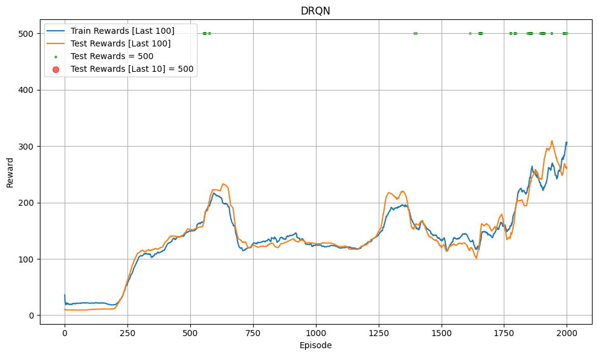
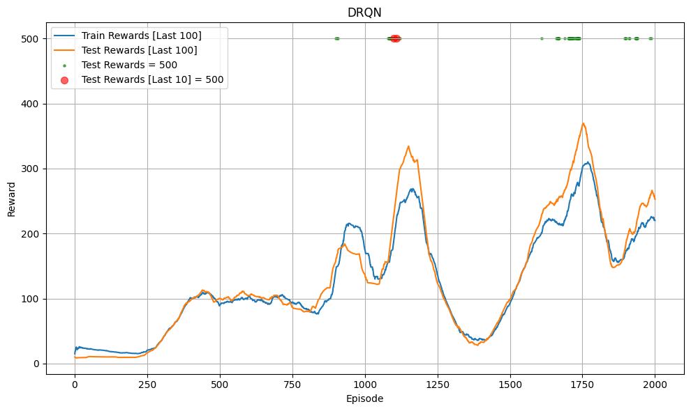
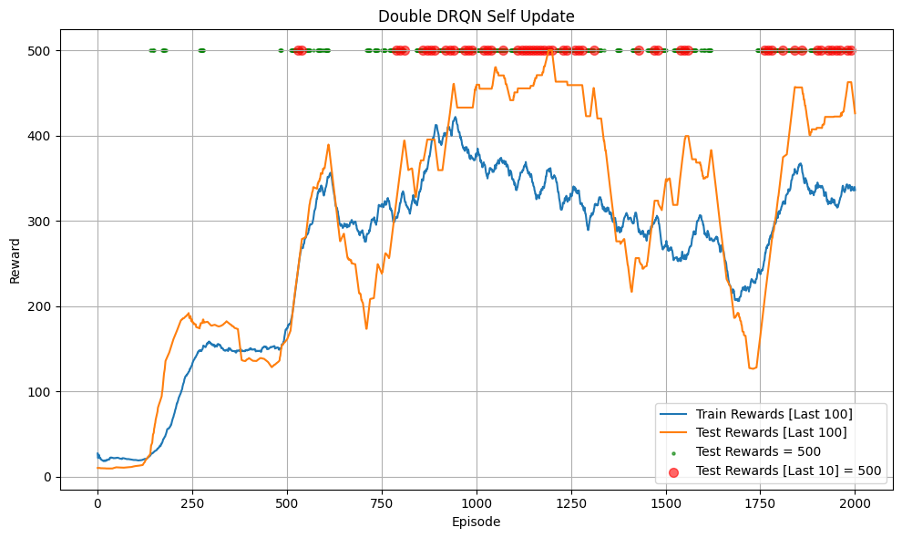
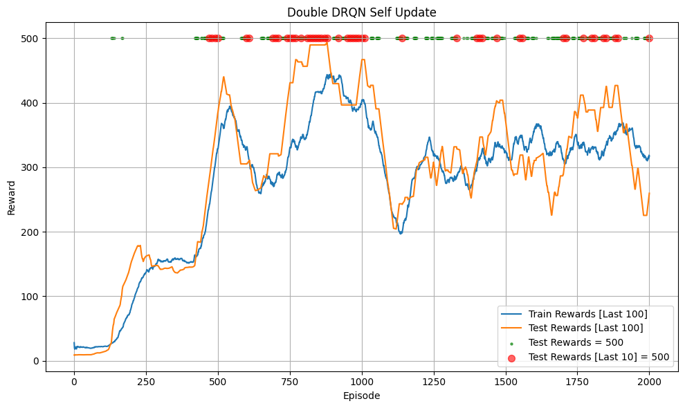
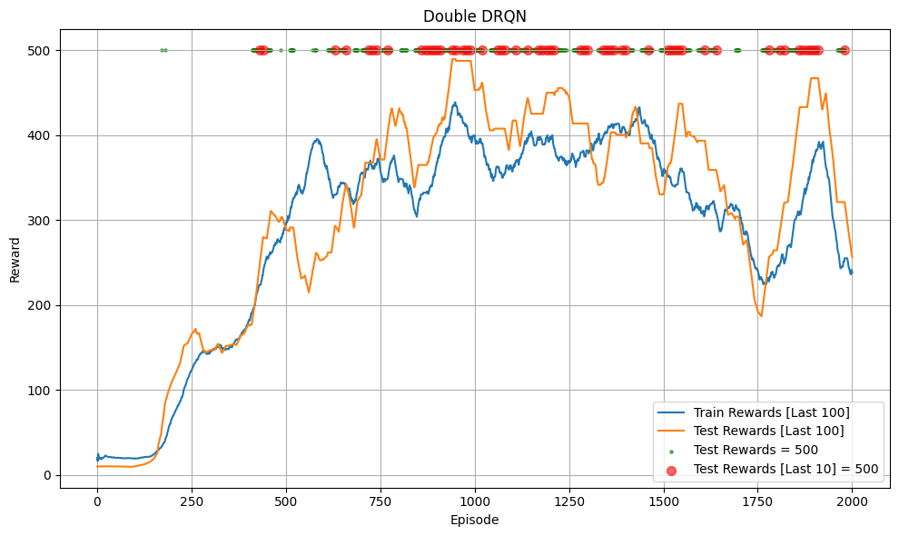
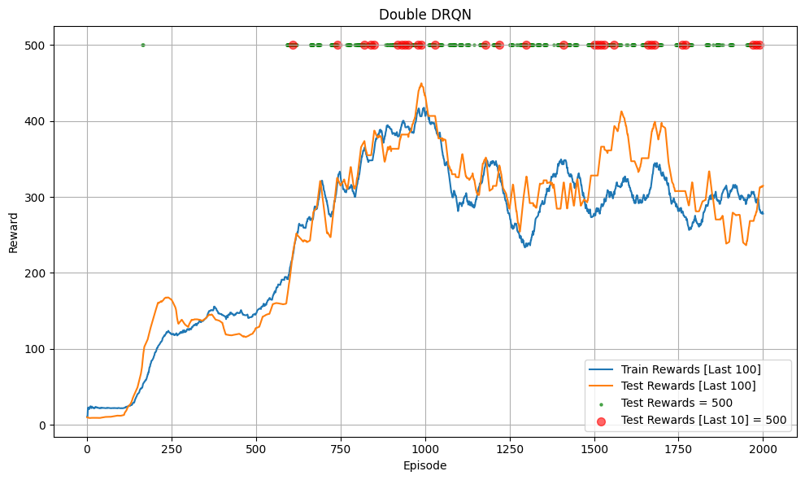

# Deep Recurrent Q-Learning (DRQN)

## Introduction

Project này là Pytorch minimal implementation [Deep Recurrent Q-Learning (DRQN)](https://arxiv.org/pdf/1507.06527). Theo tìm hiểu của tôi thì DRQN được giới thiệu đầu tiên trong paper [Deep Recurrent Q-Learning for Partially Observable MDPs](https://arxiv.org/pdf/1507.06527) là sự kết hợp giữa kiến trúc RNN và DQN, tận dụng lợi thế của RNN để giải quyết vấn đề Partially Observable MDPs (Agent chỉ quan sát được 1 phần thông tin tại mỗi bước dẫn đến thiếu thông tin, ví dụ: chỉ thấy 1 phần màng hình như người chơi chứ không thấy toàn bộ map trong environment). Với cách tiếp cận truyền thống của DQN (được implement trong DQN, Double_DQN, Dueling DQN, ...) là frame stack (stack 4 observation gần nhất thành state input) giúp Agent hiểu được thông tin từ các bước trước. DRQN giới thiệu cách dùng RNN hiệu quả hơn (trong nhiều trường hợp) thay vì stack frame. 

Paper [ViZDoom: DRQN with Prioritized Experience Replay, Double-Q Learning, & Snapshot Ensembling*](https://arxiv.org/pdf/1801.01000) cải tiến DRQN bằng cách kết hợp DRQN với Double Q learning, Prioritized Experience Replay và Snapshot Ensembling cho kết quả tốt trong trò chơi Doom. Paper cũng có 1 trick khi cập nhật: với mỡi sequence được sample, chỉ dùng những sample cuối chuỗi để cập nhật, các sample đầu sẽ không tính gradient (detach), không có report tác động của trick này!.

Để đơn giản hóa việc implement, mình chỉ codded DRQN gốc và Double-DRQN (Double-DRQN sẽ dùng thêm trick detach ở trên).

## Algorithm

Cần tìm hiểu `Deep Q-Learning (DQN)` trước. Với nhiều môi trường phức tạp (agent chỉ thấy 1 phần của environment như thấy 1 phần của map, có sự tương tác giữa các đối tượng khác với agent như nhiều phương tiện khác trong xe tự lái, ...). Observation tại mỗi bước sẽ không cung cấp đủ thông tin để Agent ra quyết định (phương tiện phía trước đang thắng hay chạy thẳng, nếu agent không biết sẽ không thắng kịp và va vào nếu xe phía trước đang thắng, hoặc chạy chậm vì thắng nhưng phương tiện phía trước vẫn chạy bình thường). Agent sẽ cần thông tin từ nhiều bước phía trước để ra quyết định (sẽ biết xe phía trước đang chạy hay thắng nếu thấy những observation phía trước dựa vào vị trí của xe đó trong các observation liền kề, cách xa nhau nếu chạy và khá sát nhau nếu thắng). Khi đó giải pháp khá đơn giản là stack frame (gộp nhiều observations thành 1 state, thường là 4). Cách này được thực nghiệm hiệu quả trong các paper DQN, Double-DQN, A2C, ...

DRQN áp dụng cách tiếp cận khác, dùng RNN để truyền chuỗi thông tin đến bước hiện tại, giúp Agent ra quyết định tốt hơn. Thay vì stack frame (4 observations) thì Agent chỉ cần 1 observation hiện tại và hidden state từ chuỗi phía trước để ra quyết định.

DRQN sẽ dùng 1 state (1 observation) và hidden state từ bước gần nhất làm input và trả về output cùng hidden state hiện tại. Khi bắt đầu 1 episode, hidden state sẽ được khởi tạo là 0 (hoặc random!).

Vì dùng RNN, khi training sẽ phải sample data theo chuỗi (episode), replay buffer sẽ lưu data của các episode thay vì từng state như DQN. Trong paper có đề cập 2 cách training:
- Sample toàn bộ episode.
- Sample một đoạn ngẫu nhiên trong episode.
- cả 2 cách đều gán hidden state là 0 và tính loss qua từng state của episode thông qua hidden state được cập nhật tại mỗi bước (loss tương tự DQN hoặc Double DQN).
- Paper DRQN thực nghiệm được 2 cách này có performance như nhau nên chọn cách sample 1 chuỗi ngẫu nhiên (sẽ ít tốn bộ nhớ hơn vì episode có thể rất dài).

Paper ViZDoom gợi ý 1 trick sẽ chỉ dùng những state cuối (3 trong 7 states trong chuỗi được sample) để tính loss. 4 states đầu sẽ giúp khởi tạo hidden state tốt hơn.

## Code Structure

Code chạy thử nghiệm DRQN với `**CartPole-v1**` trong [nodebook này](DRQN.ipynb), thử nghiệm Double_DRQN trong [nodebook này](Double_DRQN.ipynb). Lưu ý: code có thể tồn tại một số bug hoặc không tối ưu!!!

## Trained Model

Bạn có thể load [trained model](trained_model)

## Hyperparameter
Siêu tham số tương tự DQN, bạn cần lưu ý khi tunning vì thuật toán nhạy cảm với siêu tham số:
- `gamma`: 0.99
- `batch_size`: 10 (với DRQN) và 20 (với Double_DRQN).
- `gradient_step`: 5 (chỉ dùng với Double_DRQN, số state dùng để tính loss).
- `buffer_size` = 1000
- `total_episodes` = 2000 (số episode training)
- `start_training_step` = 1000 (train từ environment step nào)
- `learning_rate` = 2.3e-3
- `train_frequency`= 256 (train model sau mỗi `train_frequency` environment step)
- `epochs` = 128 (mỗi lần train model sẽ train 128 epoch)
- `update_frequency` = 100 (cập nhật target model sau `update_frequency` environment step) hoặc `tau` = 0.005 (soft update mỗi environment step)
- `epsilon` (ε):
    - `init`: 1
    - `end`: 0.04
    - Linear decay với `exploration_fraction` = 0.16 (16% `total_steps` đầu)

## Result

### DRQN

Dưới đây là kết quả khi train dùng soft update (chạy thử 2 lần):

  
  

Dưới đây là kết quả khi train không dùng soft update (chạy thử 2 lần):

  
  

Kết quả model đã đạt tổng phần thưởng tối đa:
- Model được train rất tệ, cần tuning siêu tham số để có kết quả tốt như các DQN khác.
- Environment này rất đơn giản, chỉ để kiểm tra code có hoạt động không nên không thể so sánh với các thuật toán khác như DQN, Double DQN.

### Double DRQN

Dưới đây là kết quả khi train dùng soft update (chạy thử 2 lần):

  
  

Dưới đây là kết quả khi train không dùng soft update (chạy thử 2 lần):

  
  

Kết quả model đã đạt tổng phần thưởng tối đa:
- Với cả soft update và không dùng soft update, model nhanh chống đạt tổng phần thưởng tối đa (500) khi test và duy trì mức 500 sau đó.
- Double Q Learning và trick chỉ update các state giúp DRQN hoạt động tốt hơn hẳn mà không cần tuning siêu tham số.
- Environment này rất đơn giản, chỉ để kiểm tra code có hoạt động không nên không thể so sánh với các thuật toán khác như DQN, Double DQN.

**Lưu ý**:
- Code có thể tồn tại 1 số bug
- Project có dùng Chatbot để chỉnh lỗi chính tả hoặc format code!

## Reference
- [DRQN paper](https://arxiv.org/pdf/1507.06527)
- [ViZDoom paper](https://arxiv.org/pdf/1801.01000)
- [DQN paper](https://arxiv.org/pdf/1312.5602)
- [Double DQN paper](https://arxiv.org/pdf/1509.06461)
- [Double Q-learning paper](https://proceedings.neurips.cc/paper_files/paper/2010/file/091d584fced301b442654dd8c23b3fc9-Paper.pdf)