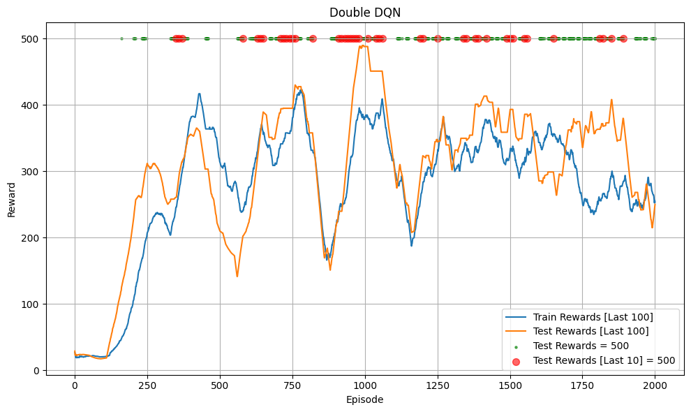

# Double Deep Q-Network (Double DQN)

## Introduction

This project is a minimal Pytorch implementation of [Double Deep Q-Network (Double_DQN)](https://arxiv.org/pdf/1509.06461). `Double Deep Q-Learning` is an improvement on the `Deep Q-Learning` algorithm to reduce the overestimation bias that `DQN` encounters.

## Algorithm

You should understand `Deep Q-Learning (DQN)` first. One problem that the q-learning algorithm (both DQN and classic Q-learning) faces is that the target network tends to overestimate the Q-value, leading to less stable training and difficulty converging (overestimation bias). The reason is believed to be the use of the Target Network to both select the next_action $a_{t+1}$ and calculate $Q(s_{t+1}, a_{t+1})$, which leads to a bias.

### Classic Double Q-learning
To reduce the overestimation bias in classic q-learning, classic Double Q-learning uses two separate $Q$-tables: $Q_A$ and $Q_B$.

In classic Q-learning, there is only one $Q$-table used to both select $a_{t+1}$ and look up $Q(s_{t+1}, a_{t+1})$. The update formula at each training step is:
$$
Q(s_t, a_t) \leftarrow Q(s_t, a_t) + \alpha \left[ r_t + \gamma \max_{a_{t+1}} Q(s_{t+1}, a_{t+1}) - Q(s_t, a_t) \right]
$$

With Double Q-learning, when calculating $Q(s_{t+1}, a_{t+1})$, we use one table to select the action (the table being updated), and the other table to look up the $Q$-value.

Specifically, at each training step, we randomly choose one $Q$-table ($Q_A$ or $Q_B$) to update. For example, if we choose $Q_A$, we will update the value for $Q_A$ and use $Q_B$ to select $a_{t+1}$:
$$
Q_A(s_t, a_t) \leftarrow Q_A(s_t, a_t) + \alpha \left[ r_t + \gamma Q_B(s_{t+1}, \arg\max_{a_{t+1}} Q_A(s_{t+1}, a_{t+1})) - Q_A(s_t, a_t) \right]
$$

### Double Deep Q-Network
With DQN, we already have two models: the online model **θ** and the target model **θ⁻**. We just need to change the way the target $y_t$ is calculated during the update, from:
$$
y_t = Q(s_t, a_t) = r_t + \gamma \max_{a_{t+1}} Q_{\text{target}}(s_{t+1}, a_{t+1})
$$

Applying Double Q-learning:

$$
y_t = Q(s_t, a_t) = r_t + \gamma Q_{\text{target}}\left(s_{t+1}, \arg\max_{a_{t+1}} Q_{\text{online}}(s_{t+1}, a_{t+1})\right)
$$

Update using MSE or huber loss just like in DQN, for example, using MSE:

$$L(\theta) = (y_t - Q(s_t, a_t; \theta))² = (y_t - Q_{\text{online}}(s_t, a_t))²$$

## Code Structure

The code for testing Double DQN with `**CartPole-v1**` is in this [notebook](Double_DQN.ipynb). Note: the code might contain some bugs or may not be optimal!!!

## Trained Model

You can load [the trained model](trained_model).

## Hyperparameter
The hyperparameters are similar to DQN, you should be careful when tuning as the algorithm is sensitive to them:
- `gamma`: 0.99
- `batch_size`: 64
- `buffer_size`: 100000
- `total_episodes`: 2000 (number of episodes training)
- `start_training_step`: 1000 (environment step to start training from)
- `learning_rate`: 2.3e-3
- `train_frequency`: 4 (train the model every `train_frequency` environment steps)
- `epochs`: 1 (train for 128 epochs each training time)
- `update_frequency`: 100 (update target model every `update_frequency` environment steps) or `tau` = 0.005 (for soft updates every environment step)
- `epsilon` (ε):
    - `init`: 1.0
    - `end`: 0.04
    - Linear decay over `exploration_fraction` = 0.16 (the first 16% of `total_steps`)

## Result

Below are the results from training with soft updates (run 2 times):

  
  

Below are the results from training with out soft updates (run 2 times):

  
  

The model successfully reached the maximum total reward:
- With both soft update and without it, the model quickly reached the maximum total reward (500) during testing and maintained the 500 level afterwards.
- This environment is very simple and is only used to check if the code works, so we cannot compare the two update methods or make a comparison with DQN.

**Note**:
- The code might contain some bugs.
- A Chatbot was used for this project to fix typos or format code!

## Reference
- [Double DQN paper](https://arxiv.org/pdf/1509.06461)
- [Double Q-learning paper](https://proceedings.neurips.cc/paper_files/paper/2010/file/091d584fced301b442654dd8c23b3fc9-Paper.pdf)
- [DQN paper](https://arxiv.org/pdf/1312.5602)