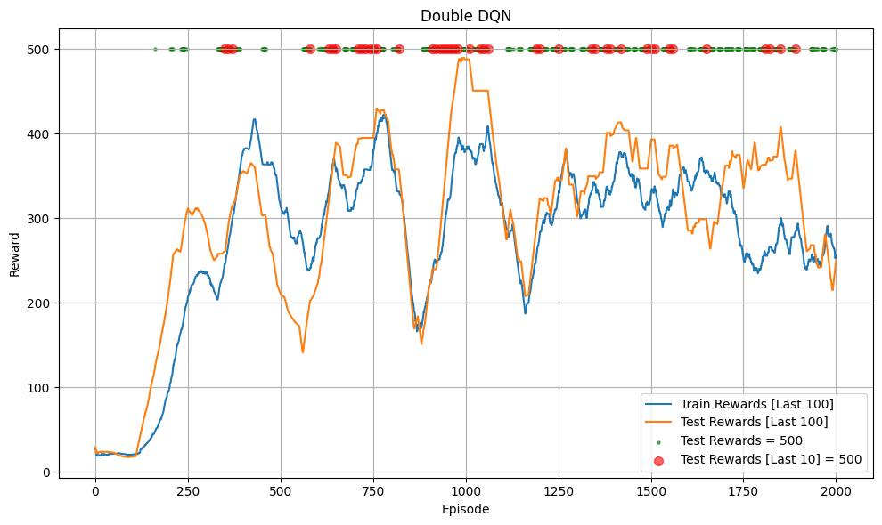
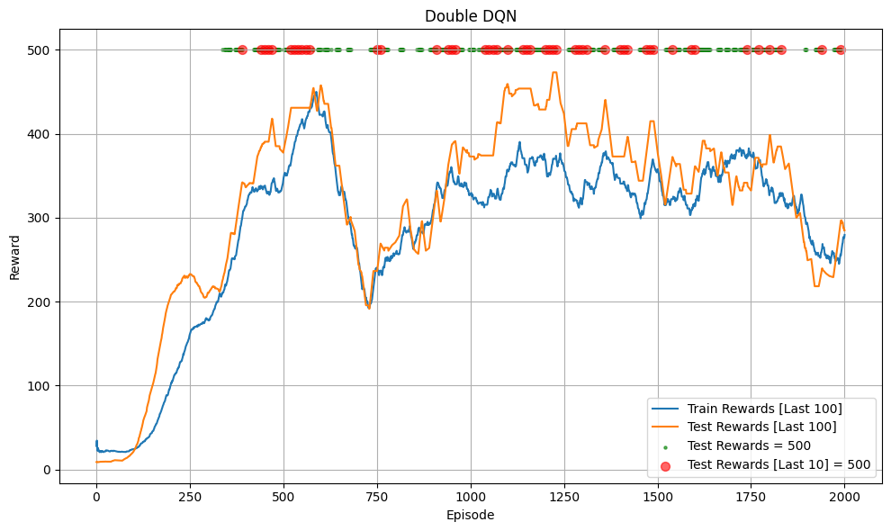

# Double Deep Q-Network (Double DQN)

## Introduction

Project này là Pytorch minimal implementation [Double Deep Q-Network (Double_DQN)](https://arxiv.org/pdf/1509.06461). `Double Deep Q-Learning` là cải tiến của thuật toán `Deep Q-Learning` nhằm giảm overestimation bias mà `DQN` gặp phải.

## Algorithm

Cần tìm hiểu `Deep Q-Learning (DQN)` trước. Một vấn đề mà thuật toán q learning (cả DQN và Q-learning cổ điển) gặp phải là target network có xu hướng estimate quá cao giá trị Q dẫn đến quá trình training kém ổn định và khó hội tụ (overestimation bias). Nguyên nhân được cho là vì dùng Target Network để chọn next_action $a_{t+1}$ và tính $Q(s_{t+1}, a_{t+1})$ dẫn đến bias.

### Double Q-learning cổ điển
Để giảm overestimation bias cho q learning cổ điển, Double Q-learning cổ điển sử dụng 2 bảng $Q$: $Q_A$, $Q_B$ riêng biệt. 

Trong Q learning cổ điển chỉ có 1 bảng $Q$ để vừa chọn $a_{t+1}$ vừa truy xuất $Q(s_{t+1}, a_{t+1})$. Công thức cập nhật tại mỗi bước training:
$$
Q(s_t, a_t) \leftarrow Q(s_t, a_t) + \alpha \left[ r_t + \gamma \max_{a_{t+1}} Q(s_{t+1}, a_{t+1}) - Q(s_t, a_t) \right]
$$

Với Double Q-learning, khi tính $Q(s_{t+1}, a_{t+1})$, ta sẽ dùng 1 bảng để chọn hành động (bảng cần cập nhật), bảng còn lại để truy xuất giá trị $Q$.

Cụ thể tại mỗi bước training, ta sẽ chọn ngẫu nhiên 1 bảng $Q$ ($Q_A$ hoặc $Q_B$) để cập nhật, ví dụ chọn $Q_A$, ta sẽ cập nhật giá trị cho $Q_A$ và dùng $Q_B$ để chọn $a_{t+1}$:
$$
Q_A(s_t, a_t) \leftarrow Q_A(s_t, a_t) + \alpha \left[ r_t + \gamma Q_B(s_{t+1}, \arg\max_{a_{t+1}} Q_A(s_{t+1}, a_{t+1})) - Q_A(s_t, a_t) \right]
$$

### Double Deep Q-Network
Với DQN, ta đã có sẵn 2 model online model **θ** và target model **θ⁻**, chỉ cần thay cách tính target $y_t$ khi cập nhật từ:
$$
y_t = Q(s_t, a_t) = r_t + \gamma \max_{a_{t+1}} Q_{\text{target}}(s_{t+1}, a_{t+1})
$$

Áp dụng Double Q-leaning:

$$
y_t = Q(s_t, a_t) = r_t + \gamma Q_{\text{target}}\left(s_{t+1}, \arg\max_{a_{t+1}} Q_{\text{online}}(s_{t+1}, a_{t+1})\right)
$$

Cập nhật bằng MSE hoặc huber loss như DQN, ví dụ dùng MSE:

$$L(\theta) = (y_t - Q(s_t, a_t; \theta))² = (y_t - Q_{\text{online}}(s_t, a_t))²$$

## Code Structure

Code chạy thử nghiệm Double DQN với `**CartPole-v1**` trong [nodebook này](Double_DQN.ipynb). Lưu ý: code có thể tồn tại một số bug hoặc không tối ưu!!!

## Trained Model

Bạn có thể load [trained model](trained_model)

## Hyperparameter
Siêu tham số tương tự DQN, bạn cần lưu ý khi tunning vì thuật toán nhạy cảm với siêu tham số:
- `gamma`: 0.99
- `batch_size`: = 64
- `buffer_size` = 100000
- `total_episodes` = 2000 (số episode training)
- `start_training_step` = 1000 (train từ environment step nào)
- `learning_rate` = 2.3e-3
- `train_frequency`= 4 (train model sau mỗi `train_frequency` environment step)
- `epochs` = 1 (mỗi lần train model sẽ train 128 epoch)
- `update_frequency` = 100 (cập nhật target model sau `update_frequency` environment step) hoặc `tau` = 0.005 (soft update mỗi environment step)
- `epsilon` (ε):
    - `init`: 1
    - `end`: 0.04
    - Linear decay với `exploration_fraction` = 0.16 (16% `total_steps` đầu)

## Result

Dưới đây là kết quả khi train dùng soft update (chạy thử 2 lần):

  
  

Dưới đây là kết quả khi train không dùng soft update (chạy thử 2 lần):

  
  

Kết quả model đã đạt tổng phần thưởng tối đa:
- Với cả soft update và không dùng soft update, model nhanh chống đạt tổng phần thưởng tối đa (500) khi test và duy trì mức 500 sau đó.
- Environment này rất đơn giản, chỉ để kiểm tra code có hoạt động không nên không thể so sánh 2 cách update hoặc so sánh với DQN.

**Lưu ý**:
- Code có thể tồn tại 1 số bug
- Project có dùng Chatbot để chỉnh lỗi chính tả hoặc format code!

## Reference
- [Double DQN paper](https://arxiv.org/pdf/1509.06461)
- [Double Q-learning paper](https://proceedings.neurips.cc/paper_files/paper/2010/file/091d584fced301b442654dd8c23b3fc9-Paper.pdf)
- [DQN paper](https://arxiv.org/pdf/1312.5602)